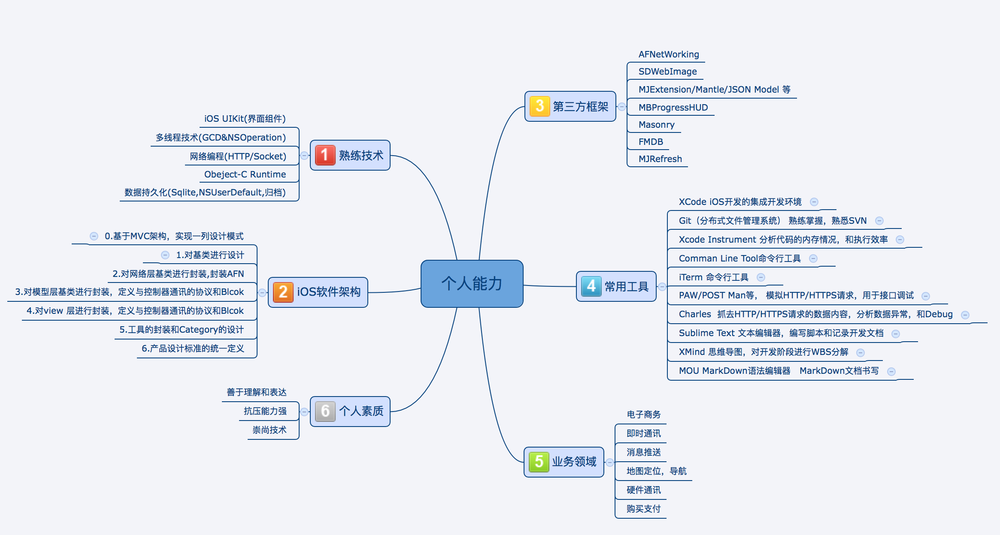

 
# 
刘浩的简历

 

| 姓名 | 年 龄 |职责|工作年限|Mobile|Mail|GitHub|Blog
|----------|----------|----------|----------|----------|----------|----------|----------|
|  刘浩 | 25|iOS工程师| 3年|17704051924|<a href = "v2top1@163.com">v2top1@163.com</a>|<a href = "https://github.com/lyleLH">https://github.com/lyleLH</a>|<a href = "http://www.lylefod.com">www.lylefod.com</a>

## 个人能力

<!--

-->

## 工作经历

| 时间 | 公司 |岗位职责|
|----------|----------|----------|----------|
|  2015.08--至今| 广东酷配电子商务|负责公司酷配养车和酷派商家App的开发迭代和维护，担任iOS组长
|  2015.04--2015.07 | 航通北斗信息科技公司|负责维护公司的多个业务线的项目，负责开发航通守护者，负责带领小组一起开发
|  2014.09--2015.03 | 第一代驾（深圳沃时诺）科技公司|单人负责公司iOS客户端的维护和iOS司机端的开发

## 项目经验

### 天马星 个人项目  [2016.05-2016.07] 
	项目说明:
		儿童3D打印机的配套应用，模型瀑布流展示，
		模型详情查看，通过调用服务端接口实现对打印机的控制。
#### 技术细节:  

<li >高可用性，高可维护性，易用的APP架构
<li >模型的3D展示和简单交互
<li >使用MJExtension完成JSON to Model 的快速转换
<li > 尽可能使用UITableView定制UI界面,提升交互体验
<li > 集成微信和QQ，微博三方登陆
<li > CocoaPods工具管理工程的依赖
<li > Git版本控制，Bitbucket代码托管
<li > fir.im工具内测分发
<li > XCode Instrment分析程序性能和优化
<li > Masonry完成多机型屏幕适配

### Mount 个人项目  [2016.03-2016.05] 
	项目说明:
		智能汽车后视镜的配套App
		主要功能有车辆故障查询，车辆定位，电子围栏，历史轨迹查询等等，

#### 技术细节:  

<li >设计和实现高可用性，高可维护性，易用的APP架构
<li >MJExtension, Masonry,MBProgressHUD MJRefresh...
<li > 使用CocoaPods工具管理工程的依赖
<li > 使用Git分支来协作开发，
<li > fir.im工具内测分发
<li> 集成百度地图SDK，地图地定义，实现地图定位，导航，和路线规划
<li> 极光推送

### 酷配养车商家版  [2015.11-2016.03]
	项目说明:
		商家可以通过app发布和管理自己的产品和服务
		管理自己的订单
		查看和管理自己的店铺
		

#### 技术细节:  

<li >设计和实现高可用性，高可维护性，易用的APP架构
<li >自研实现XMPPFrameWork框架的部分传输协议，实现即时聊天功能
<li >参与即使聊天消息模型的评审
<li >使用MJExtension完成JSON to Model 的快速转换，提升开发效率
<li > 使用UITableView完成所有UI界面,可滑动的的交互体验
<li > 集成支付宝（alipay）SDK实现支付功能
<li > 使用CocoaPods工具管理工程的依赖
<li > 使用Git分支来协作开发，
<li > fir.im工具内测分发
<li > XCode Instrment分析程序性能和优化
<li > Masonry完成多机型屏幕适配
<li> 集成百度地图SDK，实现地图定位，导航，和路线规划
<li >自定义地图，实现地图上寻找商家和切换商
家的效果
<li >多图上传的时候使用GCD&NSOperation技术
<li >UIView Animation自定义
<li >自定义UIViewController的转场效果
<li >可折叠的UITableView子类的设计和实现
<li >图片上传工具和图片浏览器的设计和实现
<li >数据持久化
<li >Singleton封装AppUser(继承自AFN子类单例的单例)统一管理网络请求和回调

### 酷配养车  [2015.08-2015.10]

		
	项目说明:
		 汽车后市场电商平台和汽车服务O2O平台车主
		 可以通过app搜索，查看，购买平台商家的产品或者服务，
		 可以查看和管理自己的订单
		 汽车用品配件商城
	 
#### 技术细节:   

<li >设计和实现高可用性，高可维护性，易用的APP架构
<li >自研实现XMPPFrameWork框架的部分传输协议，实现即时聊天功能
<li >参与即使聊天消息模型的评审
<li >使用MJExtension完成JSON to Model 的快速转换，提升开发效率
<li > 使用UITableView完成所有UI界面,可滑动的的交互体验
<li > 集成支付宝（alipay）SDK实现支付功能
<li > 使用CocoaPods工具管理工程的依赖
<li > 使用Git分支来协作开发，
<li > fir.im工具内测分发
<li > XCode Instrment分析程序性能和优化
<li > Masonry完成多机型屏幕适配
<li> 集成百度地图SDK，实现地图定位，导航，和路线规划
<li >自定义地图，实现地图上寻找商家和切换商家的效果
<li >UIView Animation自定义
<li >可折叠的UITableView子类的设计和实现
<li >图片上传工具和图片浏览器的设计和实现
<li >数据持久化

### 航通守护者 [2015.04-2015.07]
	  
 	项目说明:
 		和公司的多款针对小孩和老人的定位追踪器配合使用
 		主要有历史轨迹，实时定位，电子围栏等功能

#### 技术细节  
<li > 设计和实现常用对象所属类的基类
<li > 独立实现高可用性的项目架构，基于MVC
<li > 使用MJExtension完成JSON to Model 的快速转换，提升开发效率
<li > sqlite3数据持久化
<li > 集成百度地图SDK，高德地图SDK 和Google Map SDK,实现地图定位，导航，和路线规划，
<li > 自定义地图界面
<li > 使用NSTimer和MSWeakTimer 实现线程安全的计时器，得到等待和完成时间，计算费用
<li > CoreAnimation动画自定义
<li > 集成JPush SDK(极光推送)完成推送功能，计时触发本地通知
<li > 封装AFNetWorking,SDWebImage等高频使用的第三方库
<li > 实现XMPPFramework的协议，完成即使聊天功能
<li > 使用UITableView完成所有UI界面,可滑动的的交互体验
<li > 集成支付宝（alipay）SDK实现支付功能
<li > UIWebView的应用
	
	
####	UUAID ，珠宝卫视，UU助手蓝牙版 等项目的维护和扩展及重构 2015.04-2015.07
##### 技术细节 :
<li >多个项目的维护和迭代
<li >国际化多语言打包
<li >使用fir.im和蒲公英平台快速内侧分发
<li >制作公司传输协议的静态库 lib.a文件
<li >制作蓝牙传输和控制的演示 demo

###  <li > 第一代驾司机端  [2014.11-2015.03]
		项目说明:
		司机通过app接到后台派单或者客服排单
		推送到司机端，开始代驾流程，并完成订单

#### 技术细节:   

<li > 集成百度地图SDK,实现地图定位，导航，和路线规划，
<li > 使用NSTimer和MSWeakTimer 实现线程安全的计时器，得到等待和完成时间，计算费用
<li > CoreAnimation动画自定义
<li > 集成JPush SDK(极光推送)完成推送功能，计时触发本地通知
<li > 封装AFNetWorking,SDWebImage等高频使用的第三方库
<li > 实现XMPPFramework的协议，完成即使聊天功能
<li > UITableView完成可滑动的所有UI界面,
<li > 集成支付宝（alipay）SDK实现支付功能

 
		
#### 武汉智通达电子科技公司 ［2014.05-2015.11］
	 经历说明: 
	 在校期间在公司实习和毕业后一段时间的工作
	 参与一些转包的项目的部份简单的功能模块的UI搭建和部分功能模块的实现

#### 项目:
<li >爱狗狗等
<li >亲生活
<li >开心赚 
 

## 自我介绍

- 理解能力强
- 表达能力强
- 身体健康

 
 
 
 
 
